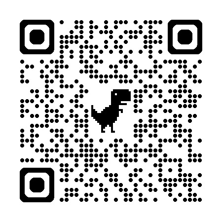

```
# Classifying Medieval Manuscripts by Pen and Support
[](LICENSE)  



This is the official code repository for the paper: **"Classifying Medieval Manuscripts by Pen and Support"**.

## Abstract
We present a machine-learning approach for classifying medieval Hebrew manuscripts by two key material attributes: writing support (whether the substrate is paper or
parchment) and writing implement (quill pen vs. reed calamus). Our work contributes to the emerging field of computational codicology, offering tools to aid paleographers
in the large-scale analysis of digitized manuscripts. Our datasets—derived from existing digitized repositories—have been carefully annotated and balanced to capture
the range of material and stylistic variation. For both classification tasks, we employ convolutional neural networks tailored to their respective challenges: identifying
broad substrate textures and capturing fine-grained stroke morphology. The support classifier achieved an accuracy of 91% and demonstrated reliable performance even on
visually ambiguous examples. Likewise, the implement classifier was 91.5% accurate. These findings show that computational analysis can aid and, in some cases, surpass manual paleographic methods in analyzing historical manuscripts. This work highlights the potential of computational tools to assist scholars in large-scale analysis of
digitized corpora, aiding manuscript dating, provenance research, and the study of scribal practices.

## Code

The code used for this project will be uploaded soon. Please check back later.

## Citation

If you use this work, please cite the original paper:

Sharva Gogawale, Omer Ventura, Daria Vasyutinsky-Shapira, Berat Kurar-Barakat, Gal Grudka,  
Mohammad Suliman, Iddo Hakim, and Nachum Dershowitz. *“Classifying Medieval Manuscripts by Pen and Support.”*

Or using BibTeX:

```bibtex
@article{10.63744@tL5xGcaScd42,
  title = {Classifying Medieval Manuscripts by Pen and Support},
  author = {Sharva Gogawale and Omer Ventura and Daria \{Vasyutinsky-Shapira\} and Berat \{Kurar-Barakat\} and Gal Grudka and Mohammad Suliman and Iddo Hakim and Nachum Dershowitz},
  year = {2025},
  journal = {Anthology of Computers and the Humanities},
  volume = {3},
  pages = {1349--1359},
  editor = {Taylor Arnold, Margherita Fantoli, and Ruben Ros},
  doi = {10.63744/tL5xGcaScd42}
}
```

## Data Sources

This work uses digitized manuscripts from the following repositories:

- Bodleian Libraries, University of Oxford, https://digital.bodleian.ox.ac.uk, Creative Commons licence CC-BY-NC 4.0.

- Bibliothèque nationale de France, https://gallica.bnf.fr/accueil/fr/html/accueil-fr

- Staatsbibliothek zu Berlin https://digital.staatsbibliothek-berlin.de

- Getty, https://www.getty.edu

- HebrewPal https://www.hebrewpalaeography.com

- Bayerische Staatsbibliothek, https://www.digitale-sammlungen.de/en/hebrew-manuscripts

- Cambridge, St John's College, Creative Commons Attribution-NonCommercial 4.0 Unported License (CC BY-NC 4.0), https://cudl.lib.cam.ac.uk

- Mark Farnadi-Jerusálmi, 'Bologna, BU MS. 2208: Psalms 18', in: Hebrew Palaeography Album, General Editors: Judith Olszowy-Schlanger. Consulted online at https://www.hebrewpalaeography.com/data/itemimages/230/ on 2025-12-06.

```
